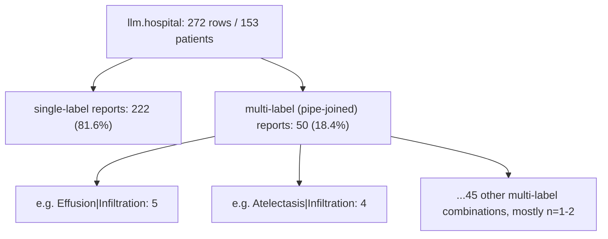
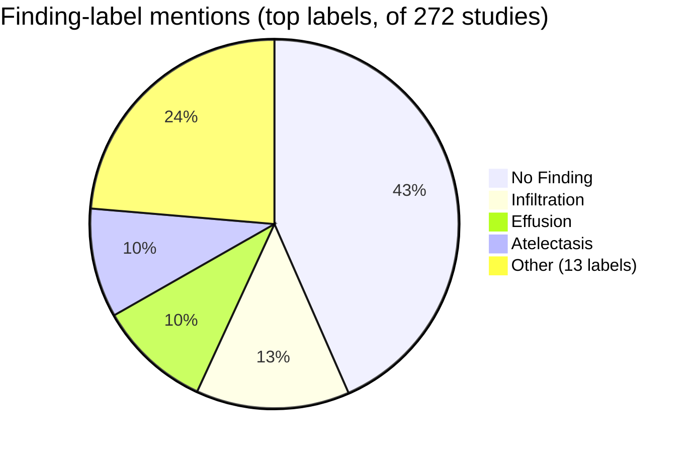

# Deep dive: CF2Seg (Grounding Radiology Report Findings into Medical Image Segmentation)

- Paper: [Grounding Radiology Report Findings into Medical Image Segmentation](https://doi.org/10.1038/s41746-026-03051-0), npj Digital Medicine, 2026
- Approved plan: `analysis/2/plan.md`
- Source issue: [#2](../../issues/2)

## What the paper reports

CF2Seg (Clinical-Findings-Guided Segmentation) is a chest X-ray segmentation model that uses
full radiology report text (not just a diagnosis label) to guide pixel-level lesion localization.
The authors curated a benchmark of **53,386 examinations**, each paired with **expert pixel-level
segmentation annotations** and a report, across multiple institutions and thoracic pathologies.
CF2Seg reportedly holds up under distribution shift, annotation scarcity, and realistic
image/report perturbations (paper abstract, linked above).

## What our data shows

All numbers below come from `llm.hospital` (masked view) via `query-medical-db`.

**Cohort size**
```sql
SELECT count(*) AS total_rows, count(DISTINCT patient_key) AS distinct_patients FROM llm.hospital;
```
→ 272 rows / 153 distinct patients.

**Single- vs multi-finding reports** (CF2Seg's motivating scenario is reports describing more
than one finding, which are harder to spatially disentangle from text alone):
```sql
SELECT (findings_label LIKE '%|%') AS is_multi, count(*) AS n
FROM llm.hospital GROUP BY is_multi;
```
→ single-label 222 (81.6%), multi-label (pipe-joined) 50 (18.4%).

**Individual finding-label frequency** (labels split on `|`, so a multi-label report is counted
once per label it contains):
```sql
SELECT unnest(string_to_array(findings_label,'|')) AS label, count(*) AS n
FROM llm.hospital GROUP BY label ORDER BY n DESC LIMIT 15;
```

| Label | Count |
|---|---|
| No Finding | 145 |
| Infiltration | 45 |
| Effusion | 33 |
| Atelectasis | 32 |
| Fibrosis | 13 |
| Nodule | 12 |
| Pneumothorax | 12 |
| Cardiomegaly | 10 |
| Pleural_Thickening | 9 |
| Emphysema | 9 |
| Consolidation | 7 |
| Edema | 6 |
| Pneumonia | 3 |
| Mass | 2 |
| Hernia | 2 |

See `figure.svg` for the bar chart (individual labels, top 10) and the single-/multi-label split.

**Report text length**
```sql
SELECT min(length(report_text)) AS min_len,
       avg(length(report_text))::numeric(10,1) AS mean_len,
       max(length(report_text)) AS max_len
FROM llm.hospital WHERE report_text IS NOT NULL;
```
→ min 140, mean 184.2, max 330 characters.

**Institution and view-position spread**
```sql
SELECT institution_code, count(*) AS n FROM llm.hospital GROUP BY institution_code ORDER BY n DESC;
SELECT view_position, count(*) AS n FROM llm.hospital GROUP BY view_position ORDER BY n DESC;
```
→ INST01 62, INST02 56, INST03 54, INST05 52, INST04 48 (5 institutions, fairly balanced).
→ PA 184, AP 88.

A manual read of 3 randomly sampled multi-label reports confirmed the style: short, templated
sentences (e.g. "Pleural effusion is evident on the left. Lobar pneumonia pattern is observed."),
consistent with the ~184-character average.

## Cohort filtering (mermaid)



## Distribution chart (mermaid)



<details>
<summary>Full findings_label value counts (raw query output)</summary>

```
No Finding|145
Infiltration|21
Atelectasis|16
Nodule|7
Effusion|6
Fibrosis|6
Pneumothorax|5
Effusion|Infiltration|5
Cardiomegaly|5
Effusion|Pneumothorax|4
Emphysema|4
Atelectasis|Infiltration|4
Pleural_Thickening|3
Atelectasis|Pneumothorax|2
Atelectasis|Consolidation|Effusion|Infiltration|2
Effusion|Fibrosis|2
Atelectasis|Effusion|Infiltration|2
Atelectasis|Emphysema|Infiltration|2
Fibrosis|Infiltration|2
Mass|1
Edema|Effusion|1
Cardiomegaly|Edema|1
Effusion|Nodule|1
Atelectasis|Consolidation|1
Hernia|Infiltration|1
Consolidation|1
Cardiomegaly|Pleural_Thickening|1
Edema|1
Effusion|Infiltration|Nodule|Pleural_Thickening|1
Atelectasis|Pleural_Thickening|1
Effusion|Pneumonia|1
Cardiomegaly|Edema|Effusion|Fibrosis|Infiltration|1
Consolidation|Infiltration|1
Cardiomegaly|Mass|1
Emphysema|Pneumothorax|1
Consolidation|Edema|1
Hernia|1
Effusion|Pleural_Thickening|1
Pleural_Thickening|Pneumonia|1
Atelectasis|Effusion|1
Fibrosis|Nodule|1
Fibrosis|Pleural_Thickening|1
Atelectasis|Nodule|1
Effusion|Infiltration|Nodule|1
Effusion|Emphysema|1
Effusion|Emphysema|Infiltration|1
Cardiomegaly|Edema|Effusion|Infiltration|Pneumonia|1
Consolidation|Effusion|1
```
</details>

## What we infer (hypothesis-generating only)

- Our cohort contains the *type* of case CF2Seg is designed for (compound, multi-label findings
  in narrative reports, 18.4% of studies) — the problem framing transfers.
- However, we have **no pixel-level expert segmentation annotation anywhere in this cohort**, so
  CF2Seg's core reported metric (segmentation Dice/IoU) cannot be trained toward or validated
  against our data at all. This is the single fact that bounds every other observation here.
- Our `report_text` is short and templated (mean 184.2 characters, one or two sentences), unlike
  the presumably richer narrative reports in CF2Seg's 53,386-exam multi-institution benchmark.
  This is a plausible (not proven) reason a findings-guided segmentation approach trained on
  richer text might have less signal to work with in our setting — we did not attempt any
  vocabulary/length comparison against the actual benchmark text, since it is not available to us.
- Our institution (5) and view-position (PA/AP) spread is present but at a much smaller scale
  (272 vs. 53,386 exams), so no claim about cross-institution generalization can be tested here.

## Limitations

- No pixel-level or bounding-box ground truth exists in our data; nothing about actual spatial
  localization accuracy can be assessed, only the textual/structural precondition for attempting it.
- We did not have access to the paper's benchmark report text, so the "our reports look
  shorter/more templated" comparison is qualitative, based on the paper's abstract description only.
- Multi-label subgroup counts are small (single combinations mostly n=1-2), so any label-level
  analysis beyond frequency counts would be underpowered.
- All findings here are hypothesis-generating and describe whether the *problem setup* matches our
  data, not whether CF2Seg's method would perform well on it.
